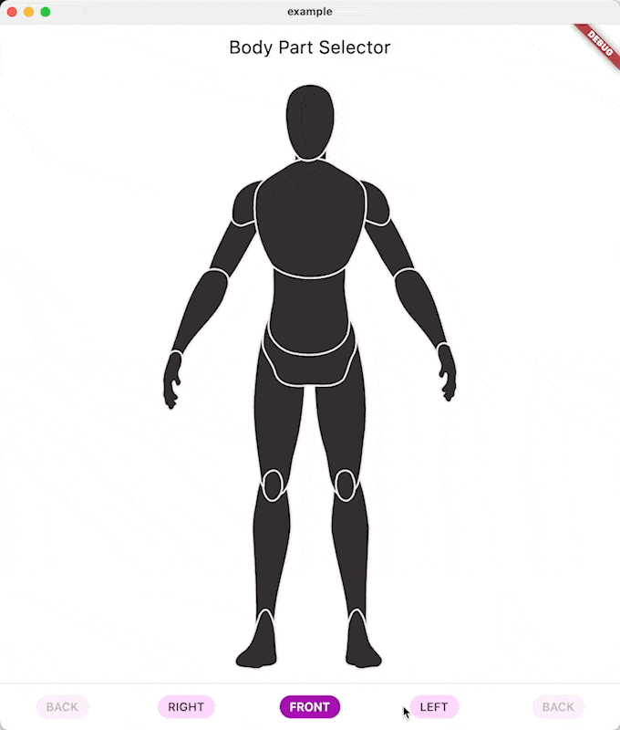

# Body Part Selector
A simple and beautiful selector for body parts.

[](https://github.com/felangel/mason)
[](https://github.com/invertase/melos)




## Installation 

**! In order to start using Body Part Selector you must have the [Dart SDK][dart_install_link] installed on your machine.**

Install via `dart pub add`:

```sh
dart pub add body_part_selector
```

## Usage
There are two widgets: `BodyPartSelector` and `BodyPartSelectorTurnable`, the latter can be seen in the GIF.

Check out the example file for a simple usage pattern.

### Listening to taps & markers

`BodyPartSelector` exposes three callbacks for interaction events:

1. `onBodyPartTapped` – unified, detailed callback for every tap related
  to markers (add + focus). Always receives a `BodyPartTapDetails` payload.
2. `onMarkerAdded` – fires only when a brand new marker is created
  (filtered subset where `action == BodyPartTapAction.markerAdded`).
3. `onMarkerFocused` – fires only when the user taps an existing marker
  without adding a new one (`action == BodyPartTapAction.markerFocused`).

All three provide the same `BodyPartTapDetails` instance so you can choose the
API style that best matches your integration platform (e.g. FlutterFlow, where
conditionals on enums may be more cumbersome). The widget stores markers
internally, renders them as pins (highlighting a segment while it still owns at
least one marker) and returns the full, current marker list in every payload so
you can persist and later restore state.

Tapping an existing pin does not mutate the list (unless you choose to in your
own code); you simply get a `markerFocused` event giving you the opportunity to
open a bottom sheet / dialog to edit or remove it.

You can fully theme the selector: customise body fill/highlight colors, outline
color and width, marker size/colour, focused-marker color, or even disable
marker outlines entirely. Pins enforce a 1 px spacing inside the SVG view box,
so every stored marker keeps unique coordinates. `BodyPartTapDetails` also
reports the active perspective (`layerSide`), letting you distinguish front,
back, left or right taps immediately.

#### Callback payload

The callback receives a `BodyPartTapDetails` instance:

```
class BodyPartTapDetails {
  final String id; // segment identifier (e.g. leftUpperArm)
  final bool isSelected; // whether the segment is selected after the tap
  final BodyParts updatedBodyParts; // snapshot of the entire selection
  final BodyPartMarker marker; // marker that triggered the callback
  final BodySide layerSide; // perspective (front/left/back/right) during tap
  final BodyPartTapAction action; // markerAdded, markerFocused (or markerRemoved)
  final List<BodyPartMarker> markers; // markers currently rendered for this side
}

class BodyPartMarker {
  final String id; // body segment associated with the marker
  final BodySide side; // anatomical side inferred from the id
  final BodySide? layerSide; // perspective in which the marker was created
  final Offset normalizedPosition; // coordinates (0..1) inside the SVG view box
  final DateTime timestamp; // marker creation timestamp
}
```

The `markers` list contains all pins currently visible for the active
perspective (in insertion order), ready to be serialised or persisted.

#### Providing existing markers

To display markers fetched from a database, convert your stored records to
`BodyPartMarker` instances and pass them through `initialMarkers`:

```
final markers = rows.map((json) => BodyPartMarker(
  id: json['id'] as String,
  side: BodySide.values.byName(json['side'] as String),
  layerSide: json['layerSide'] != null
      ? BodySide.values.byName(json['layerSide'] as String)
      : null,
  normalizedPosition: Offset(
    (json['x'] as num).toDouble(),
    (json['y'] as num).toDouble(),
  ),
  timestamp: DateTime.parse(json['timestamp'] as String),
)).toList();

BodyPartSelector(
  side: BodySide.front,
  bodyParts: bodyParts,
  onSelectionUpdated: onSelectionUpdated,
  initialMarkers: markers,
);

final turnableMarkers = {
  BodySide.front: markers,
  BodySide.back: backMarkers,
  BodySide.left: leftMarkers,
  BodySide.right: rightMarkers,
};

BodyPartSelectorTurnable(
  bodyParts: bodyParts,
  initialMarkers: turnableMarkers,
);
```

Each time the user taps, the callback returns the updated `markers` list, which
you can persist back into your storage layer.

### Constructor parameters

**BodyPartSelector**

- `bodyParts` (required): current selection object.
- `onSelectionUpdated` (required, nullable): invoked with the updated
  `BodyParts` after each interaction.
- `side` (required): which body side to render.
- `onBodyPartTapped` (optional): detailed tap callback with marker payload.
- `onMarkerAdded` (optional): fires only for newly added markers.
- `onMarkerFocused` (optional): fires only when an existing marker is tapped.
- `mirrored` (optional, defaults to `false`): toggle symmetrical selection.
- `selectedColor` (optional): highlight colour; defaults to
  `Theme.of(context).colorScheme.inversePrimary`.
- `unselectedColor` (optional): base fill colour; defaults to
  `Theme.of(context).colorScheme.inverseSurface`.
- `selectedOutlineColor` (optional): outline for active segments; defaults to
  `Theme.of(context).colorScheme.primary`.
- `unselectedOutlineColor` (optional): outline for inactive segments; defaults
  to `Theme.of(context).colorScheme.onInverseSurface`.
- `initialMarkers` (optional, defaults to empty list): pre-loaded markers for
  the current side.
- `markerColor` (optional): fill colour for pins; defaults to tertiary colour.
- `markerOutlineColor` (optional): outline colour for pins when
  `markerHasOutline` is `true`.
- `bodyFillColor` (optional): overrides base body fill colour.
- `bodyOutlineColor` (optional): overrides base outline colour.
- `bodyOutlineWidth` (optional, defaults to `2.0`): stroke width for outlines.
- `highlightColor` (optional): fill colour for selected segments.
- `markerRadius` (optional, defaults to `6.0`, minimum `1.0`): pin radius.
- `markerHasOutline` (optional, defaults to `true`): show or hide pin outlines.
- `activeMarkerColor` (optional): fill colour for the currently focused pin;
  defaults to `colorScheme.secondary`.

**BodyPartSelectorTurnable**

- `bodyParts` (required): current selection shared across rotations.
- `onSelectionUpdated` (optional): called when the shared selection changes.
- `onBodyPartTapped` (optional): detailed tap callback.
- `onMarkerAdded` (optional): new marker events across any side.
- `onMarkerFocused` (optional): existing marker tap events across any side.
- `mirrored` (optional, defaults to `false`).
- `selectedColor`, `unselectedColor`, `selectedOutlineColor`,
  `unselectedOutlineColor` (optional): forwarded to the underlying selector.
- `padding` (optional, defaults to `EdgeInsets.zero`): outer padding around the
  rotation stage.
- `labelData` (optional, defaults to English labels): captions for the four
  sides.
- `initialMarkers` (optional, defaults to empty map): map of `BodySide` to
  marker lists.
- `markerColor`, `markerOutlineColor`, `bodyFillColor`, `bodyOutlineColor`,
  `bodyOutlineWidth`, `highlightColor`, `markerRadius`, `markerHasOutline`,
  `activeMarkerColor` (optional): forwarded to the inner `BodyPartSelector` for
  each side.
- `rotateRightTrigger` (optional, defaults to `0`): increment the value to
  rotate clockwise once (handy for FlutterFlow actions).
- `rotateButtonIcon` (optional): supply a custom icon widget for the built-in
  rotate button; defaults to an SVG glyph bundled with the package.
- `showRotateButton` (optional, defaults to `true`): hides the built-in rotate
  button when set to `false`.
- `onRotateRequested` (optional): callback invoked right before any clockwise
  rotation (built-in button or external trigger) is executed.

To rotate from FlutterFlow, bind a numeric state value to `rotateRightTrigger`
and increment it inside your button action; the widget detects the change and
animates one step clockwise.

When using `BodyPartSelectorTurnable`, supply `initialMarkers` as a map keyed by
`BodySide` to pre-populate markers for each side, and handle the same
`onBodyPartTapped` callback to keep the data in sync with your backend.

### Type‑safe body part identifiers (enum)

The package exposes an enum `BodyPartId` whose values are 1:1 aligned with:
1. Field names inside the `BodyParts` data class.
2. `id` attributes in the bundled SVG assets.

This gives you type safety when storing / transmitting selections, especially
useful in tools like FlutterFlow where you may want strong constraints on
allowed strings.

Common snippets:
```dart
// Create an empty selection
var selection = const BodyParts();

// Enable a subset using enum values
selection = BodyParts.fromIds([
  BodyPartId.head,
  BodyPartId.leftKnee,
  BodyPartId.rightElbow,
]);

// Read selected ids as enum values
final selected = selection.selectedIds; // List<BodyPartId>

// Convert to plain String IDs for persistence
final stringIds = selected.map((e) => e.name).toList();

// Restore later from stored String IDs
final restored = BodyParts.fromIds(
  stringIds.map(BodyPartId.values.byName),
);
```

#### FlutterFlow integration

In a Custom Action or Custom Widget you can:
```dart
import 'package:body_part_selector/body_part_selector.dart';

// Toggle a part by its enum id using existing API
BodyParts togglePart(BodyParts current, BodyPartId id, {bool mirror = false}) {
  return current.withToggledId(id.name, mirror: mirror);
}

// Produce JSON map for storage (e.g. in Firestore)
Map<String, bool> toStorage(BodyParts parts) => parts.toMap();

// Recreate from list of enum names stored in an array field
BodyParts fromStoredStrings(List<String> ids) =>
    BodyParts.fromIds(ids.map(BodyPartId.values.byName));
```

Because the enum names must stay in sync with the SVG ids, treat adding/removing
enum values as a breaking change (semver: major). The test suite contains a
consistency test to guarantee alignment.

## Example
To run the example open the ``example`` folder and run ``flutter create .``


### Asset attribution

The illustrative body SVGs bundled with this package originate from
[Flow-Orbiter's human_body_selector_fo project][asset_credit] and are used in
accordance with its license. Please retain the original attribution if you
reuse or modify these assets.

[asset_credit]: https://github.com/Flow-Orbiter/human_body_selector_fo/tree/main/assets
---

[dart_install_link]: https://dart.dev/get-dart
[github_actions_link]: https://docs.github.com/en/actions/learn-github-actions
[license_badge]: https://img.shields.io/badge/license-MIT-blue.svg
[license_link]: https://opensource.org/licenses/MIT
[mason_link]: https://github.com/felangel/mason
